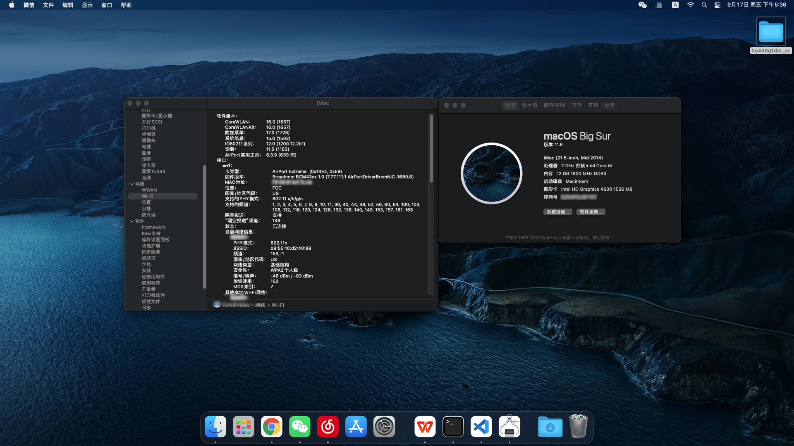

# OpenCore EFI for HP Prodesk 400 G1 Desktop Mini Business PC

## OS Version
* macOS Big Sur 11.6

## Configuration

| Specifications | Details                                  |
| --------------------- | ----------------------------------- |
| Computer Model        | HP Prodesk 400 G1 DM       			|
| Processor             | Intel i5-4590T                      |
| Graphics              | Intel HD4600                        |
| Sound Card            | Realtek ALC221 (layout-id: 11)      |
| Ethernet		        | Intel  I217LM                   	|
| Wireless / Bluetooth  | BCM943224PCIEBT2 (with adapter)   |
| Storage               | COLORFUL CN600                    |

## Features
* SMBIOS iMac14,4 (iMac 21.5-inch, Mid 2014)
* OpenCore-0.7.3-RELEASE
* Lilu-1.5.7-DevBuild-09072021
* VirtualSMC-1.2.8-DevBuild-09082021
* WhateverGreen-1.5.4-DevBuild-09072021
* AppleALC-1.6.4-RELEASE
* IntelMausiEthernet-2.5.3d3-DevBuild-06202021
* USBMap
* USBInjectAll-0.7.1-RELEASE `(disabled in config.plist)`
* AirportBrcmFixup-2.1.3-RELEASE `(AirPortBrcm4360_Injector.kext disabled in config.plist)`
* BrcmPatchRam-2.6.0-RELEASE
* NVMeFix-1.0.9-RELEASE `(disabled in config.plist)`

### Issues
* VGA output not work
